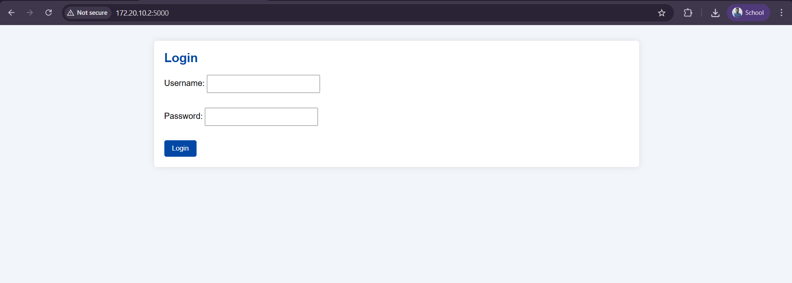
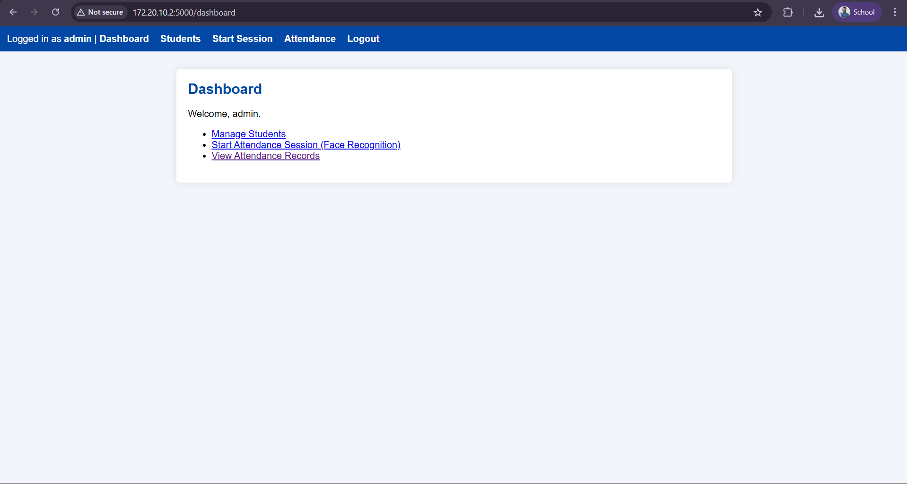
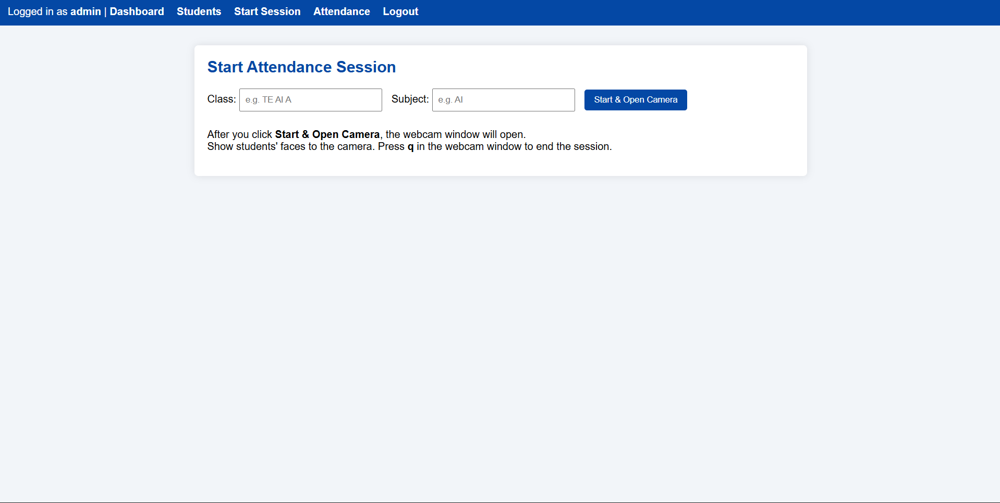
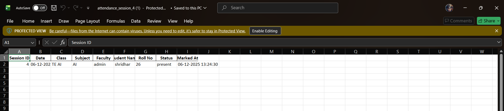

# Face Recognition Attendance System

A smart attendance management system using **Face Recognition** to automate student presence marking.  
Faculty can start a session, the camera recognizes students, marks attendance with timestamps, and exports reports to **Excel**.  
It also works from **mobile browser** over the same Wi-Fi/hotspot — making it usable in real classrooms.
## demo video : https://www.linkedin.com/posts/shridhar-kalasgonda-86b03a295_python-flask-opencv-ugcPost-7405617083092377600-8z_c?utm_source=social_share_send&utm_medium=member_desktop_web&rcm=ACoAAEdfy1MBx9W2TBVt-jWizHfkkfZKRq4_voo
---

## 🚀 Features

- Register student and capture face encodings (no raw images stored)
- Real-time face recognition using webcam or IP camera
- Session-based attendance (Class, Subject, Faculty, Date, Time)
- Export attendance for each session as an Excel (.xlsx) file
- Simple and clean UI (Flask + HTML + CSS)
- Run and control system from mobile device on same network
- SQLite backend — lightweight and offline friendly

---

## 🛠 Tech Stack

| Technology | Purpose |
|-----------|---------|
| Python | Core language |
| Flask | Web Framework |
| OpenCV | Camera Capture & Processing |
| face_recognition | Deep Face Encodings |
| SQLite + SQLAlchemy | Database |
| Pandas + openpyxl | Excel Export |
| HTML + CSS | UI Templates |

---

## 📁 Project Structure

```text
face_attendance/
│
├── app.py                ---> Main Flask app
├── models.py             ---> Database models
├── face_utils.py         ---> Face registration & recognition
├── requirements.txt      ---> All Python dependencies
│
├── templates/            ---> UI Pages (HTML)
│   ├── login.html
│   ├── dashboard.html
│   ├── students.html
│   ├── start_session.html
│   └── view_attendance.html
│
├── static/               ---> CSS Files
│   └── style.css
│
├── student_faces/        ---> Stored Face Encodings (ignored in Git)
└── attendance.db         ---> SQLite DB (ignored in Git)
```

---

## 📸 Screenshots

### 🔐 Login Page  


### 🏠 Dashboard  


### ➕ Add Student  


### 🎥 Start Attendance Session  


### 📋 Attendance  


### 📥 Excel Export Preview  


---
## ⚙️ Setup & Run

```bash
git clone https://github.com/shridhar07122004/face-attendance-system.git
cd face-attendance-system

python -m venv venv
venv\Scripts\activate   # On Windows

pip install -r requirements.txt
py app.py
```

Open browser:

```
http://127.0.0.1:5000
```

**Default Login**

```
username: admin
password: admin
```

---


## 🧠 How Face Recognition Works

- Captures multiple frames
- Converts to **128-D face embedding vector**
- Compares new embedding to stored encodings
- If distance below threshold → Mark Present
- Only numerical vectors saved — no raw images stored

---

## 🔮 Future Enhancements

- Liveness detection (prevents photo spoofing)
- QR + Face dual authentication
- Cloud-hosted database + app
- Email / SMS to absentees
- Geo-location validation
- Defaulter report auto generation

---

## 📝 License

This project is licensed under the **MIT License** — Free to use, modify, and distribute with attribution.
